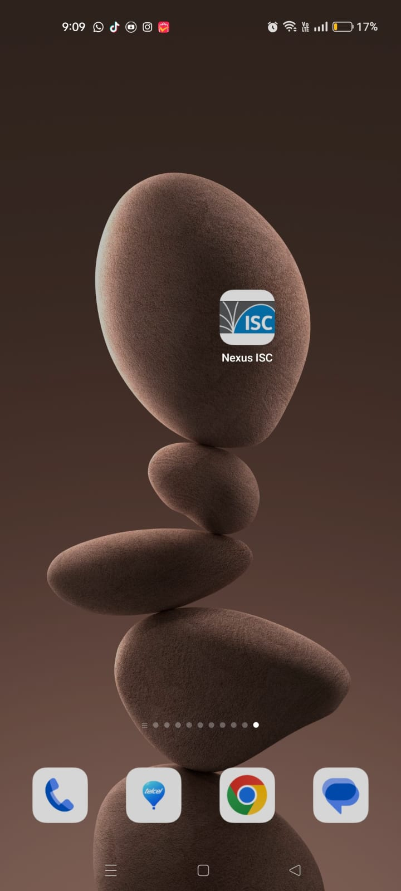
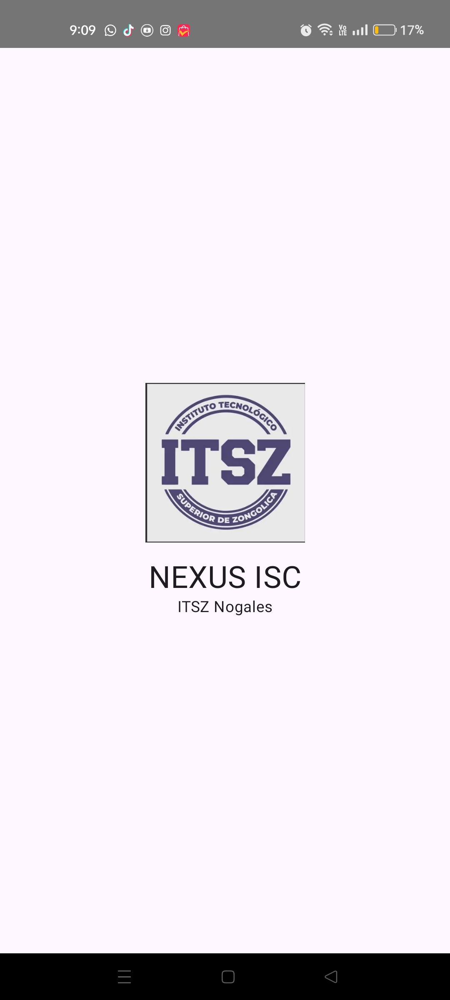
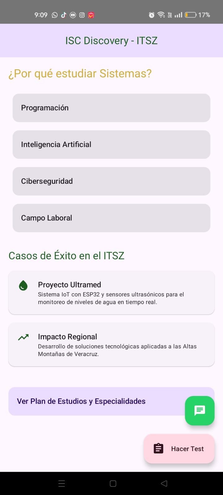
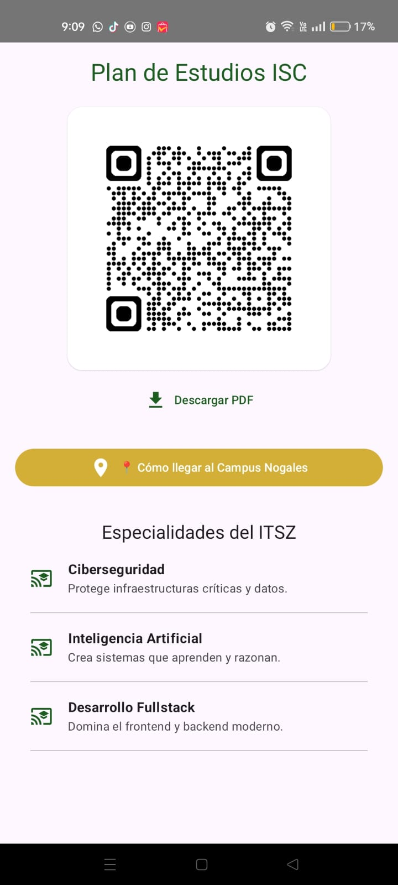
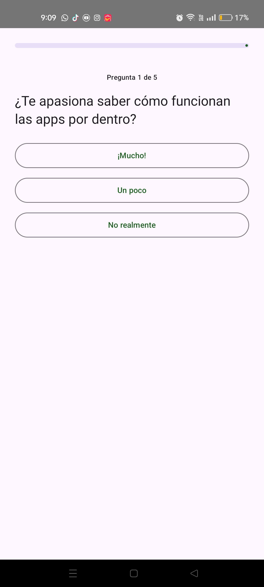
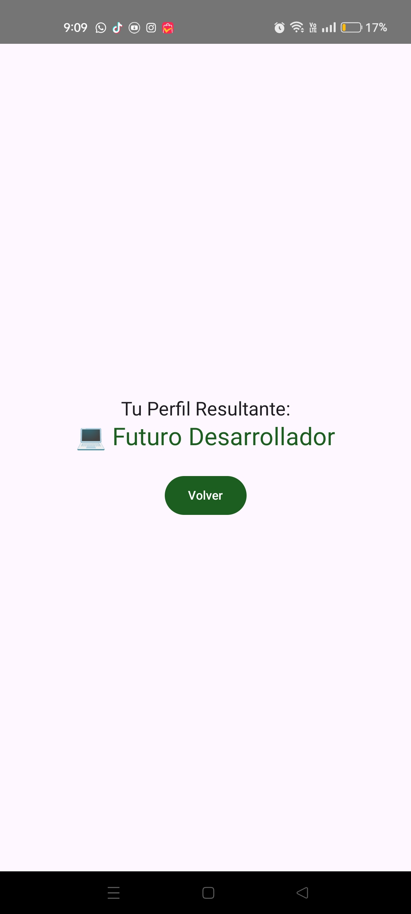

# -Discovery-App
# Discovery App - Promoción ISC (NexusISC)

## 👥 Integrantes del Equipo
* JORGE ARMANDO OROZCO AGUIRRE
* JESÚS CÁRDENAS HERNÁNDEZ 
* ESTEBAN JONATHAN VARGAS MOTA
* CESAR JIMENEZ VAZQUEZ 

---

## 📱 Descripción del Proyecto
La **ISC Discovery App** es una aplicación móvil interactiva de tipo infografía, diseñada exclusivamente para dispositivos Android. Su propósito principal es promocionar la carrera de Ingeniería en Sistemas Computacionales (y la oferta educativa general) del Instituto Tecnológico Superior de Zongolica (ITSZ) entre estudiantes de nivel medio superior. La aplicación funciona como una herramienta moderna de orientación vocacional que informa, atrae y conecta a los futuros universitarios de la región de las Altas Montañas con la institución.

## 🚀 Características y Funcionalidades Clave

* **Catálogo Interactivo de Oferta Educativa:** Un "feed" visual basado en tarjetas (Cards) que muestra las carreras del ITSZ. Incluye descripciones dinámicas, perfiles de egreso y barras de progreso animadas que ilustran la demanda laboral actual de cada disciplina.
* **Módulo de Mercado Laboral:** Una sección estratégica que proyecta el futuro profesional del egresado. Detalla los roles de trabajo más solicitados, las habilidades técnicas requeridas en la industria y expectativas salariales para motivar a los estudiantes.
* **Test Vocacional Inteligente ("¿Es Sistemas para ti?"):** Un cuestionario interactivo que evalúa los intereses y aptitudes del usuario. Utiliza lógica de estado continuo para no perder el progreso del estudiante y arroja un perfil de compatibilidad personalizado al finalizar.
* **Centro de Contacto Inmediato:** Integración de botones de acción rápida (Floating Action Buttons) que redirigen al usuario directamente a un chat de WhatsApp para atención de admisiones, junto con la facilidad de descargar el plan de estudios oficial a través de un Código QR integrado en la interfaz.

## 🛠 Arquitectura y Stack Tecnológico

* **Desarrollo Frontend:** Construida 100% en Kotlin utilizando Jetpack Compose para generar una interfaz de usuario declarativa, fluida y con el estilo visual moderno de Material Design 3.
* **Gestión de Rutas:** Implementación de Compose Navigation para un enrutamiento seguro y ágil entre las múltiples pantallas del sistema.
* **Patrón de Diseño:** Estructurada bajo los principios de arquitectura moderna de Android, separando los datos institucionales (Modelos) de la representación visual (Vistas) para un código limpio y escalable.
* **Experiencia de Usuario (UX):** Uso intensivo de animaciones nativas (AnimatedVisibility), transiciones escalonadas y manejo de retención de estado (`rememberSaveable`) para garantizar que la app se sienta profesional y responsiva.

---

## 📸 Capturas de Pantalla (UI)

# Discovery App - Promoción ISC (NexusISC)

## 👥 Integrantes del Equipo
* JORGE ARMANDO OROZCO AGUIRRE
* JESÚS CÁRDENAS HERNÁNDEZ 
* ESTEBAN JONATHAN VARGAS MOTA
* CESAR JIMENEZ VAZQUEZ 

---

## 📱 Descripción del Proyecto
La **ISC Discovery App** es una aplicación móvil interactiva de tipo infografía, diseñada exclusivamente para dispositivos Android. Su propósito principal es promocionar la carrera de Ingeniería en Sistemas Computacionales (y la oferta educativa general) del Instituto Tecnológico Superior de Zongolica (ITSZ) entre estudiantes de nivel medio superior. La aplicación funciona como una herramienta moderna de orientación vocacional que informa, atrae y conecta a los futuros universitarios de la región de las Altas Montañas con la institución.

## 🚀 Características y Funcionalidades Clave

* **Catálogo Interactivo de Oferta Educativa:** Un "feed" visual basado en tarjetas (Cards) que muestra las carreras del ITSZ. Incluye descripciones dinámicas, perfiles de egreso y barras de progreso animadas que ilustran la demanda laboral actual de cada disciplina.
* **Módulo de Mercado Laboral:** Una sección estratégica que proyecta el futuro profesional del egresado. Detalla los roles de trabajo más solicitados, las habilidades técnicas requeridas en la industria y expectativas salariales para motivar a los estudiantes.
* **Test Vocacional Inteligente ("¿Es Sistemas para ti?"):** Un cuestionario interactivo que evalúa los intereses y aptitudes del usuario. Utiliza lógica de estado continuo para no perder el progreso del estudiante y arroja un perfil de compatibilidad personalizado al finalizar.
* **Centro de Contacto Inmediato:** Integración de botones de acción rápida (Floating Action Buttons) que redirigen al usuario directamente a un chat de WhatsApp para atención de admisiones, junto con la facilidad de descargar el plan de estudios oficial a través de un Código QR integrado en la interfaz.

## 🛠 Arquitectura y Stack Tecnológico

* **Desarrollo Frontend:** Construida 100% en Kotlin utilizando Jetpack Compose para generar una interfaz de usuario declarativa, fluida y con el estilo visual moderno de Material Design 3.
* **Gestión de Rutas:** Implementación de Compose Navigation para un enrutamiento seguro y ágil entre las múltiples pantallas del sistema.
* **Patrón de Diseño:** Estructurada bajo los principios de arquitectura moderna de Android, separando los datos institucionales (Modelos) de la representación visual (Vistas) para un código limpio y escalable.
* **Experiencia de Usuario (UX):** Uso intensivo de animaciones nativas (AnimatedVisibility), transiciones escalonadas y manejo de retención de estado (`rememberSaveable`) para garantizar que la app se sienta profesional y responsiva.

---

## 📸 Capturas de Pantalla (UI)

